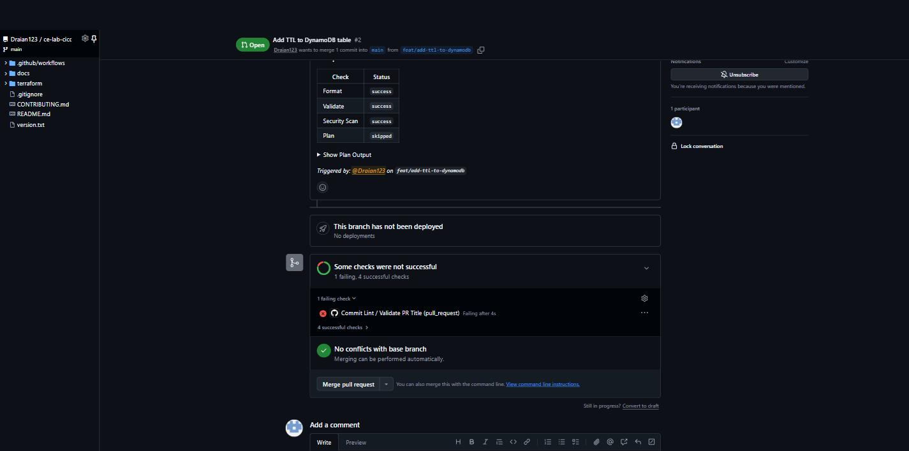
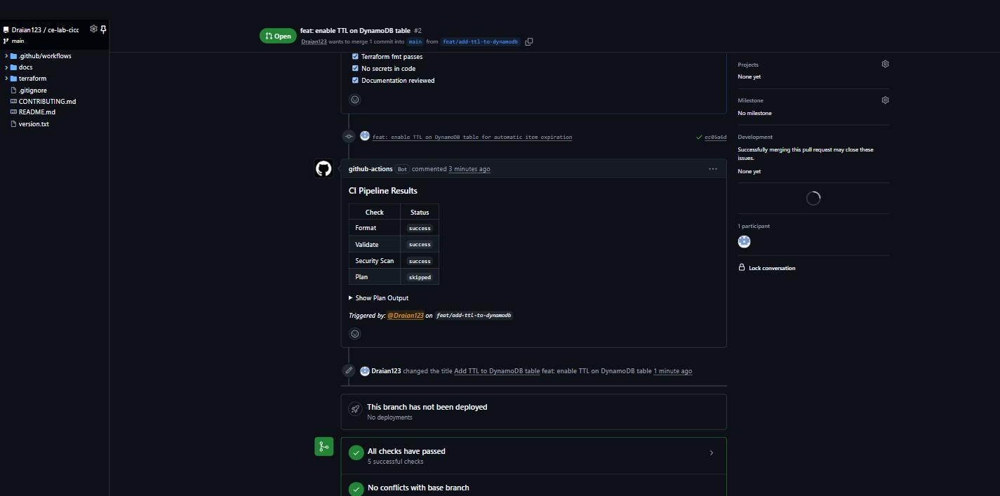
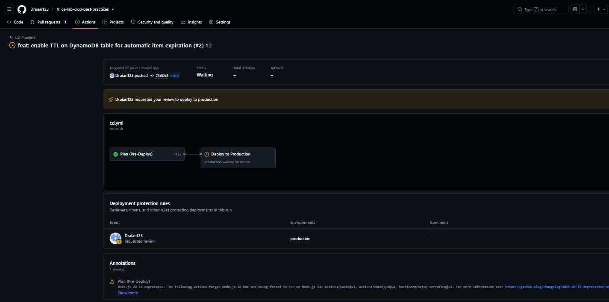
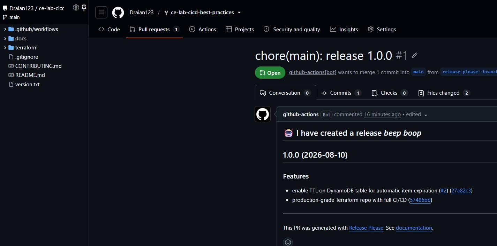

# CI/CD Best Practices — Terraform Infrastructure

[](https://github.com/Draian123/ce-lab-cicd-best-practices/actions/workflows/ci.yml)
[](https://github.com/Draian123/ce-lab-cicd-best-practices/actions/workflows/cd.yml)
[](https://github.com/Draian123/ce-lab-cicd-best-practices/actions/workflows/commit-lint.yml)
[](https://github.com/Draian123/ce-lab-cicd-best-practices/actions/workflows/release.yml)

**Lab M5.10 — Cloud Engineering Bootcamp, Week 5, Day 5.** A production-grade Terraform repository
with CI/CD wired in from the first commit: enforced commit conventions, automated versioning, a full
CI gate, and a CD pipeline that will not deploy without a human saying yes.

## Architecture

This repository manages shared infrastructure resources:

- **S3 bucket** — versioned artifact storage with AES256 encryption, a full public-access block, and a
  lifecycle rule that moves objects to `STANDARD_IA` after 90 days and expires noncurrent versions
  after 180 days
- **DynamoDB table** — application state store (`PK`/`SK` composite key, on-demand billing) with
  point-in-time recovery, server-side encryption, and TTL on `ExpiresAt`

## CI/CD Workflows

| Workflow | Trigger | Purpose |
|----------|---------|---------|
| [CI Pipeline](.github/workflows/ci.yml) | PR to `main` (paths: `terraform/**`) | Format, validate, security scan, plan |
| [CD Pipeline](.github/workflows/cd.yml) | Push to `main` (paths: `terraform/**`) | Plan, then deploy behind a manual approval gate |
| [Commit Lint](.github/workflows/commit-lint.yml) | PR opened / edited / synchronized | Enforce conventional PR titles |
| [Release Please](.github/workflows/release.yml) | Push to `main` | Automated versioning and changelog |

### The CI gate

```
format ──┐
validate ─┼── plan ── PR comment with results table
tfsec ───┘
```

`format`, `validate` and `security-scan` run in parallel; `plan` waits for all three via
`needs: [format, validate, security-scan]`. A `concurrency` group cancels superseded runs when a
branch is pushed twice in quick succession, and a `paths:` filter keeps the pipeline out of the way
of documentation-only changes.

### The CD gate

`plan` runs automatically on merge. `deploy` declares `environment: production`, which has a
**required reviewer** configured — the job sits in *Waiting* until a human approves it in the
Actions UI. Nothing is applied before that click.

## Quick Start

```bash
cd terraform
terraform init
terraform plan
terraform apply
```

## Repository Structure

```
ce-lab-cicd-best-practices/
├── .github/workflows/
│   ├── ci.yml                    # format ∥ validate ∥ tfsec → plan
│   ├── cd.yml                    # plan → deploy (manual approval)
│   ├── commit-lint.yml           # conventional PR titles
│   └── release.yml               # release-please semantic versioning
├── terraform/
│   ├── main.tf                   # S3 artifacts bucket + DynamoDB state table
│   ├── variables.tf              # with validation on `environment`
│   └── outputs.tf
├── docs/
│   ├── POSTMORTEM_TEMPLATE.md    # deployment failure playbook
│   └── screenshots/              # evidence from the Actions runs
├── CONTRIBUTING.md               # commit conventions and PR process
├── CHANGELOG.md                  # generated by release-please
├── version.txt                   # tracked by release-please
└── README.md
```

## Verified End to End

Every gate in this repository was exercised on a real change —
[PR #2, `feat: enable TTL on DynamoDB table`](https://github.com/Draian123/ce-lab-cicd-best-practices/pull/2).

### 1. Commit lint rejects a non-conventional title

The PR was deliberately opened as **"Add TTL to DynamoDB table"** — no `type:` prefix. `Validate PR
Title` failed within 4 seconds while all four CI checks passed, which is exactly the intended split:
the code was fine, the convention was not.



Renaming the PR to `feat: enable TTL on DynamoDB table` re-triggered the check (the workflow listens
for `edited`) and it went green — 5/5 checks.



### 2. CI posts its results to the PR

The `plan` job comments a results table on every run, so reviewers see the outcome without opening
the Actions tab:

| Check | Status |
|-------|--------|
| Format | `success` |
| Validate | `success` |
| Security Scan | `success` |
| Plan | `skipped` (no AWS credentials — see notes) |

### 3. CD stops at the approval gate

Merging the PR started the CD pipeline. `Plan (Pre-Deploy)` finished in 12 s; `Deploy to Production`
then stopped dead at *production — waiting for review*. Nothing reaches `terraform apply` without a
human approving the deployment.



### 4. release-please versions the repo from the commit history

The `feat:` commits produced a release PR with a generated changelog. Merging it tagged **v1.0.0**,
published a GitHub release, wrote [CHANGELOG.md](CHANGELOG.md) and bumped `version.txt` — no manual
version editing anywhere.



## Contributing

See [CONTRIBUTING.md](CONTRIBUTING.md) for commit conventions, the PR process, and CI/CD guidelines.
When a deployment goes wrong, write it up with
[docs/POSTMORTEM_TEMPLATE.md](docs/POSTMORTEM_TEMPLATE.md).

## Notes on this implementation

- **Terraform 1.13.1**, not the 1.6.0 shown in the lab handout. HashiCorp's release signing key
  (`72D7468F`) expired on 2026-04-18, and Terraform 1.6.0 ships an embedded copy of it, so
  `terraform init` fails with `openpgp: key expired` and cannot install any provider. The version is
  set once per workflow via a `TERRAFORM_VERSION` env var so there is a single place to bump it.
- **`terraform plan` and `terraform apply` are guarded** by `if: env.AWS_ACCESS_KEY_ID != ''`. No AWS
  credentials are configured in this repository, so those steps report as skipped instead of failing
  the pipeline. Adding `AWS_ACCESS_KEY_ID` / `AWS_SECRET_ACCESS_KEY` as repository secrets turns them
  on with no other change. The approval gate is unaffected — it fires before the job runs at all.
- **Two repository settings** are required for this setup and are not in code:
  - `production` environment with **required reviewers** (Settings → Environments) — without it the
    `deploy` job runs immediately and there is no gate.
  - **Allow GitHub Actions to create and approve pull requests** (Settings → Actions → General) —
    release-please fails with `GitHub Actions is not permitted to create or approve pull requests`
    until this is on. Default workflow permissions are deliberately left at *read-only*; each
    workflow requests exactly the scopes it needs in its own `permissions:` block.
